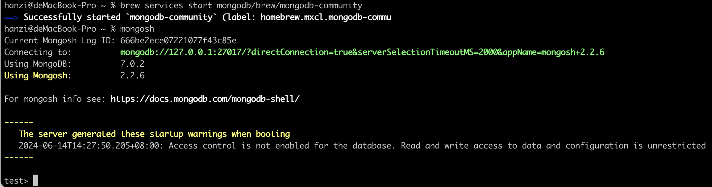

# express + mongoDb 实现登录注册、curd todoList
1. 启动一个服务
2. 基础路由、静态文件访问
3. 页面发送请求
4. 链接数据库
5. 实现登录注册
6. curd todo

## 1. 使用express启动一个服务 ( examples 01)
```
# 创建目录
mkdir 01
cd 01
# 初始化 package.json
npm init -y
# 安装express
npm i express
```
index.js如下
```
const express = require('express');
const app = express() // 创建一个 Express.js 应用程序实例
const port = 3000 // 默认端口

// 定义一个基础路由
app.get('/', (req, res) => {
  res.send('Hello World!')
})

// 监听端口，控制台打印服务已启动
app.listen(port, () => {
  console.log(`Example app listening on port ${port}`)
})
```
在项目目录下运行 `node index` 打开浏览器访问 http://localhost:3000/， 看到 Hello World!即说明成功

## 2. 基础路由和静态文件访问 页面请求和响应 /submit接口（examples 02）
在项目中新建public目录/index.html文件、index2.html文件
```html
<!-- index.html -->
<!DOCTYPE html>
<html lang="en">

<head>
  <meta charset="UTF-8">
  <meta name="viewport" content="width=device-width, initial-scale=1.0">
  <title>Document</title>
</head>

<body>
  <script src="http://libs.baidu.com/jquery/2.0.0/jquery.min.js"></script>
  <h1>这是index.html文件</h1>
  <input type="text" id="name" placeholder="用户名">
  <input type="password" id="pwd" placeholder="密码">
  <button id="btn">提交</button>
  <p>
    你提交的信息为
  </p>
  <p>用户名: <span id="iname"></span>, 密码： <span id="ipwd"></span></p>
  <script>
    $(document).ready(function () {
      $('#btn').on('click', () => {
        let name = $('#name').val()
        let pwd = $('#pwd').val()
        $.post('/submit', { name, pwd }, data => {
          console.log(data)
          let { name: n, pwd: p } = data
          $('#iname').html(n)
          $('#ipwd').html(p)
        })
      })
    });
  </script>
</body>

</html>
```


index.js中增加
```
// 静态文件服务 此时启动服务打开浏览器访问http://localhost:3000/即可看到index.html文件
app.use(express.static(path.join(__dirname, 'public')));

// 访问 index2.html文件
app.get('/index2', (req, res) => {
  // 返回public下的index2.html文件
  res.sendFile(path.join(__dirname, 'public', 'index2.html'))
})

```

安装body-parser解析请求参数
`npm i body-parser`
index.js中增加
```
const bodyParser = require('body-parser');

// 使用 body-parser 中间件
app.use(bodyParser.json()); // 解析 JSON 格式的请求体：如果请求体是 JSON 格式的， 会自动将其解析为 JavaScript 对象,并将其添加到 req.body 对象中
app.use(bodyParser.urlencoded({ extended: true })); // 解析 URL-encoded 格式的请求体

// 定义post请求 接收页面请求并解析参数
app.post('/submit', (req, res) => {
  console.log('req.body', req.body)
  // 定义http状态为200， 发送接收到的请求参数
  res.status(200).send(req.body)
})
```
项目根目录下运行 `node index`, 访问http://localhost:3000， 即可看到index.html文件，访问http://localhost:3000/index2， 即可看到index2.html文件
回到 http://localhost:3000， 在页面用户名和密码分别输入 u, p, 点击提交，可在页面和控制台看到请求参数 `{name: 'u', pwd: 'p'}`

完整index.js文件
```js
const express = require('express');
const path = require('path');
const bodyParser = require('body-parser');

const app = express()
const port = 3000

// 配置express静态文件服务
// app.use(): 这是 Express.js 中的一个中间件函数, 用于将一个中间件函数添加到应用程序的请求处理流程中。
// express.static(path.join(__dirname, 'public'))
// express.static() 是 Express.js 提供的一个内置中间件函数, 用于提供静态文件服务。
// path.join(__dirname, 'public') 是用来构建静态文件目录的路径。__dirname 是 Node.js 中的一个特殊变量, 它表示当前脚本所在的目录。'public' 则是静态文件所在的目录名称。
// 这样配置之后, Express.js 应用程序就可以在 http://localhost:3000/ 这样的路径下访问 public 目录中的静态文件了,比如 CSS、JavaScript、图片等。
// 静态文件：当前目录下的public目录， 浏览器访问http://localhost:3000/会自动寻找public目录下的index.html文件，若index.html存在 会覆盖掉app.get('/') 路由的请求
app.use(express.static(path.join(__dirname, 'public')));

// 使用 body-parser 中间件
app.use(bodyParser.json()); // 解析 JSON 格式的请求体：如果请求体是 JSON 格式的， 会自动将其解析为 JavaScript 对象,并将其添加到 req.body 对象中
app.use(bodyParser.urlencoded({ extended: true })); // 解析 URL-encoded 格式的请求体

// get('/')请求会默认寻找静态目录下的index.html文件
// app.get('/', (req, res) => {
//   res.send('succ')
// })

// 访问 index2.html文件
app.get('/index2', (req, res) => {
  // 返回public下的index2.html文件
  res.sendFile(path.join(__dirname, 'public', 'index2.html'))
})

// 定义post请求 接收页面请求并解析参数
app.post('/submit', (req, res) => {
  console.log('req.body', req.body)
  // 定义http状态为200， 发送接收到的请求参数
  res.status(200).send(req.body)
})

app.listen(port, () => {
  console.log(`Example app listening on port ${port}`)
})
```

## 3. 安装MongoDB，在控制台连接数据库并创建基础表
安装MongoDB社区版本
https://www.mongodb.com/try/download/community
选择 MongoDB Community Server Download
安装成功后在终端 `brew services start mongodb/brew/mongodb-community` 启动服务
使用 `mongosh` 回车 看到连接服务即说明启动成功，此时已进入mongoshell命令模式


MongoDB服务 和 mongshell基础命令 (以下命令均在mac环境下)
```shell
# 验证 MongoDB 是否正在运行
brew services list # 应该看到该服务mongodb-community列为 started

# 启动 MongoDB
brew services start mongodb/brew/mongodb-community 
# 或
brew services start mongodb-community@7.0

# 关闭MongoDB
brew services stop mongodb/brew/mongodb-community

# 服务启动后 使用`mongosh`进入mongoshell命令模式
# 查看所有数据库
show dbs
# 切换/使用数据库
use 数据库名
# 查看数据库中有那些集合(表)
show collections
# 查询集合中所有文档(数据)
db.集合.find()

db.movies.find()
# 相当于
SELECT * FROM movies

# 指定查询条件
db.movies.find( { "title": "Titanic" } )
# 相当于
SELECT * FROM movies WHERE title = "Titanic"

# 插入单个文档 db.collection.insertOne()
db.movies.insertOne(
  {
    title: "The Favourite",
    year: 2019,
    type: "movie"
  }
)

# 更新单个文档 db.collection.updateOne()
db.movies.updateOne(
    {  title: "The Favourite" }, // 过滤条件
    { $set: { year: 2022 } }, // 更新操作
    { upsert: false }  // 可选参数， upsert： 如果没有匹配的文档，是否插入一个新文档
);

# 删除单个文档 db.collection.deleteOne()
db.movies.deleteOne( { title: "The Favourite" } )
```

## 4. express + mongodb.js 连接数据库实现登录注册 （examples 03）
```html
<!-- index.html -->
 <head>
  <script src="https://cdn.jsdelivr.net/npm/vue@2"></script>
  <script src="https://cdn.jsdelivr.net/npm/axios/dist/axios.min.js"></script>
</head>
<body>
  <h1>连接数据库、登录注册</h1>
  <div id="app">
    <div class="wrap">
      <div class="left">
        <input type="text" id="name" placeholder="用户名" v-model="name">
        <input type="text" id="pwd" placeholder="密码" v-model="pwd">
        <button id="btn" @click="submit('l')">登录</button>
        <button id="btn" @click="submit('r')">注册</button>
      </div>
    </div>
  </div>
  <script>
    var app = new Vue({
      el: "#app",
      data() {
        return {
          name: '',
          pwd: '',
        }
      },
      methods: {
        submit(f) {
          let { name, pwd } = this
          if(!name || !pwd) return 
          let url = f == 'l' ? 'login' : 'register'
          axios.post('/' + url, { name, pwd }, { timeout: 1000, }).then(res => {
            console.log('res', res)
            alert(`${url} success`)
          }).catch(err => {
            console.log('err', err)
          })
        },
      },
      mounted() {
      },
    });
  </script>
</body>
```

```js
// index.js
const { MongoClient } = require("mongodb");
var dbUrl = "mongodb://localhost:27017/";
const client = new MongoClient(dbUrl);

// 定义login请求路由
app.post('/login', (req, res) => {
  console.log('req.body', req.body)
  res.setHeader('Content-Type', 'text/plain; charset=utf-8');
  let { name, pwd: password } = req.body

  const database = client.db('todo_system');
  const table = database.collection('users');
  const query = { name, password }

  table.findOne(query).then(rest => {
    console.log('rest', rest)
    if (!rest) {
      res.status(500).send({ message: `登录失败` })
      return
    }
    res.status(200).send(rest)
    // client.close();
  }).catch(error => {
    console.error(error)
    res.status(500).send({message: 'Database result processing error'})
    // client.close();
  })
})

// 定义register请求路由
app.post('/register', (req, res) => {
  // console.log('req', req)
  console.log('req.body', req.body)
  res.setHeader('Content-Type', 'text/plain; charset=utf-8');
  let { name, pwd: password } = req.body

  const database = client.db('todo_system');
  const table = database.collection('users');
  const query = { name, password }

  table.insertOne(query).then(rest => {
    console.log('rest', rest)
    if (!rest) {
      res.status(500).send({ message: `注册失败` })
      return
    }
    res.status(200).send(rest)
    // client.close();
  }).catch(error => {
    console.error(error)
    res.status(500).send({message: 'Database result processing error'})
    // client.close();
  })
})
```

## 5. session登录 + 超时判断， 使用mongoose.js 连接数据库，实现个人todoList操作 （example 04）
1. 使用session做用户登录
用户登录成功后，在session中存储用户信息，并在http响应中设置cookie值，后续请求中使用中间件判断用户是否登录
2. 登录超时，设置10分钟超时时间，10分钟无请求则判断已超时， 提示重新登录
```js
// index.js
const session = require('express-session');
const cookieParser = require('cookie-parser');

// session设置
app.use(session({
  name: 'todo-session', // 这里定义了自定义的 session ID cookie 名称， 不定义则默认为 connect.sid
  secret: 'your-secret-key', // 建议使用一个随机的字符串作为密钥
  resave: false,
  saveUninitialized: true,
  cookie: {
    secure: false,  // 在 HTTPS 上使用时设为 true， 设置为 true 时，cookie 只会在 HTTPS 连接中发送。为了开发环境的方便，通常在开发时设为 false。
    httpOnly: false, // 设置为 false 以允许 JavaScript 获取 cookie
    maxAge: 5 * 60 * 1000 // 1 分钟的有效期
  }
}));

// 检查用户是否登录
function checkAuth(req, res, next) {
  console.log('req.session', req.session)
  if (req.session && req.session.user) {
    next();
  } else {
    res.status(401).send({ message: 'Unauthorized.' });
  }
}

// 检查用户是否超时
function checkTimeout(req, res, next) {
  const currentTime = new Date().getTime();
  const lastActivityTime = req.session.lastActivity ? new Date(req.session.lastActivity).getTime() : currentTime;
  const timeout = 10 * 60 * 1000; // 10分钟
  if (currentTime - lastActivityTime > timeout) {
    req.session.destroy();
    res.status(401).send({ message: 'Session timeout. Please login again.' });
  } else {
    req.session.lastActivity = new Date();
    next();
  }
}

// 登录 成功则将用户信息存于session并返回cookie
app.post('/login', async (req, res) => {
  // console.log('req', req)
  console.log('req.body', req.body)
  res.setHeader('Content-Type', 'text/plain; charset=utf-8');
  let { name, pwd: password } = req.body

  const user = await User.findOne({ name, password });
  console.log('user', user)
  if (user) {
    req.session.user = user; // 将用户信息存储在 session 中
    // res.send('Login successful.');
    res.status(200).send(user)
  } else {
    res.status(401).send({ message: 'Invalid username or password.' });
  }
})

// 获取数据列表， 登录判断 和超时判断
app.get('/list', checkAuth, checkTimeout, async (req, res) => {
  let list = await Todo.find({ userId: req.session.user._id })
  console.log('list', list)
  res.status(200).send(list)
})

```

3. 使用 mongoose.js 代替 mongodb.js 连接和操作数据库
mongoose.js 提供了强大的模式定义和模型功能，可以定义数据结构和数据验证规则。
mongodb.js 原生查询语法
```js
const mongoose = require('mongoose');

// 定义数据模型
const userSchema = new mongoose.Schema({
  name: { type: String, required: true },
  age: { type: Number, min: 0 },
  email: { type: String, required: true, unique: true }
});

const User = mongoose.model('User', userSchema);

// 创建新用户
const newUser = new User({ name: 'John', age: 30, email: 'john@example.com' });
newUser.save()
  .then(user => console.log('User saved:', user))
  .catch(err => console.error('Error:', err));

// 查询用户
User.find({ age: { $gt: 18 } })
  .then(users => console.log('Users:', users))
  .catch(err => console.error('Error:', err));
```
3. 登录成功后获取个人todo列表，并实现增删改查功能
```
<script>
    var app = new Vue({
      el: "#app",
      data() {
        return {
          message: "Hello,World!",
          name: 'zys',
          pwd: '111111',
          todaValue: '',
          list: [
            // {
            //   id: '',
            //   todaValue: '',
            //   edit: false,
            // }
          ],
          isLogin: false, // 是否登录
        }
      },
      methods: {
        // 登录/注册
        submit(f) {
          let { name, pwd } = this
          console.log('name', name, 'pwd', pwd)
          let url = f == 'l' ? '/login' : '/register'
          axios.post(url, { name, pwd }, { timeout: 1000, }).then(res => {
            console.log(url + 'res', res)
            if (f == 'l') {
              console.log('登录成功')
              this.isLogin = true
              this.getList()
            } else {
              console.log('注册成功， 请登录')
            }
          }).catch(err => {
            console.log('err', err)
            alert(err.message || '请求失败')
          })
        },

        // 获取todoList
        getList() {
          axios.get('/list').then(res => {
            console.log('getList /list res', res)
            let { data } = res
            data = data.map(d => ({ ...d, edit: false }))
            this.list.splice(0, Infinity, ...data)
          })
        },

        // 添加todo
        addTodo() {
          let { todaValue } = this
          axios.post('/add', { todaValue }).then(res => {
            console.log('/add res', res)
            this.todaValue = ''
            this.getList()
          })
        },

        // 编辑项目
        editItem(item) {
          let { _id, todaValue } = item
          axios.post('/editItem', { _id, todaValue }).then(res => {
            console.log('editItem res', res)
            console.log('修改成功')
            item.edit = false
          })
        },

        // 删除数据项
        delItem({ _id }) {
          axios.post('/deleteItem', { _id }).then(res => {
            console.log('/deleteItem res', res)
            this.getList()
          })
        },

        // 退出登录
        logout() {
          axios.post('/logout').then(res => {
            console.log('/logout res', res)
            this.isLogin = false
          })
        },
      },
      mounted() {
        console.log('app 组件加载')
      },
    });
  </script>
```